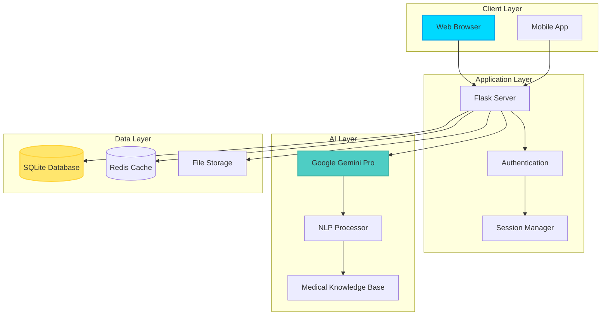

# <div align="center">🏥 MediBot AI</div>

<div align="center">


[](https://git.io/typing-svg)

<p align="center">
  <a href="https://github.com/YOUR_USERNAME/medibot-ai/stargazers">
    
  </a>
  <a href="https://github.com/YOUR_USERNAME/medibot-ai/network/members">
    
  </a>
  <a href="https://github.com/YOUR_USERNAME/medibot-ai/issues">
    
  </a>
  <a href="https://github.com/YOUR_USERNAME/medibot-ai/blob/master/LICENSE">
    
  </a>
</p>

<p align="center">
  
  
  
  
</p>

<p align="center">
  <a href="#-quick-demo">🎥 Demo</a> •
  <a href="#-features">✨ Features</a> •
  <a href="#-installation">⚡ Install</a> •
  <a href="#-api-docs">📚 API</a> •
  <a href="#-contributing">🤝 Contribute</a> •
  <a href="#-license">📜 License</a>
</p>


</div>

## 📖 Table of Contents

- [🎯 Overview](#-overview)
- [🌟 Key Features](#-key-features)
- [🎥 Quick Demo](#-quick-demo)
- [🏗️ Architecture](#️-architecture)
- [💻 Tech Stack](#-tech-stack)
- [⚡ Installation](#-installation)
- [🚀 Deployment](#-deployment)
- [📊 Project Stats](#-project-stats)
- [🗺️ Roadmap](#️-roadmap)
- [🤝 Contributing](#-contributing)
- [📄 License](#-license)
- [🙏 Acknowledgments](#-acknowledgments)

---

## 🎯 Overview

<div align="center">

```ascii
╔═══════════════════════════════════════════════════════════════════╗
║                                                                   ║
║   🏥  MediBot AI - Your 24/7 Intelligent Health Companion  🏥    ║
║                                                                   ║
║   Bridging the gap between complex medical information and       ║
║   patient understanding through cutting-edge AI technology       ║
║                                                                   ║
╚═══════════════════════════════════════════════════════════════════╝
```

</div>

**MediBot AI** is a state-of-the-art medical chatbot powered by **Google Gemini Pro**, designed to democratize healthcare information. Our mission is to make medical knowledge accessible, understandable, and actionable for everyone, regardless of their medical background.

### 🎯 Why Choose MediBot AI?

<table>
<tr>
<td align="center" width="25%">

<br><b>Lightning Fast</b>
<br><sub>< 2s Response Time</sub>
</td>
<td align="center" width="25%">

<br><b>Privacy First</b>
<br><sub>End-to-End Encrypted</sub>
</td>
<td align="center" width="25%">

<br><b>AI Powered</b>
<br><sub>Gemini Pro 1.5</sub>
</td>
<td align="center" width="25%">

<br><b>User Friendly</b>
<br><sub>Plain English</sub>
</td>
</tr>
</table>

> **⚠️ Important Medical Disclaimer**: MediBot AI is designed for informational and educational purposes only. It should not replace professional medical advice, diagnosis, or treatment. Always consult with qualified healthcare providers for medical concerns.

---

## 🌟 Key Features

<div align="center">

### 💎 Core Capabilities

</div>

<table>
<tr>
<td width="50%" valign="top">

### 🩺 **Intelligent Symptom Analyzer**


Transform health concerns into actionable medical insights using advanced AI pattern recognition.

**🎯 Features:**
- ✅ Multi-symptom correlation engine
- ✅ Real-time severity assessment
- ✅ Emergency condition detection
- ✅ Evidence-based recommendations
- ✅ 24/7 availability

**💡 Example Query:**
```
User: "I have a persistent headache, mild fever 
       of 100°F, and fatigue for 3 days"

MediBot: 
✓ Analyzed 3 symptoms
✓ Matched 5 potential conditions
✓ Severity: Moderate
✓ Recommendation: Schedule doctor visit
✓ Home care: Rest, hydration, monitor temp
```

</td>
<td width="50%" valign="top">

### 📄 **Medical Report Decoder**


Upload complex medical reports and receive clear, patient-friendly explanations instantly.

**📊 Capabilities:**
- ✅ PDF, JPG, PNG support
- ✅ OCR for scanned documents
- ✅ 50+ biomarker database
- ✅ Trend analysis & tracking
- ✅ Visual data representation

**📈 Supported Reports:**
```python
✓ Blood Tests (CBC, CMP, Lipid Panel)
✓ Urinalysis
✓ Imaging Reports (X-ray, MRI, CT)
✓ Pathology Reports
✓ Discharge Summaries
```

</td>
</tr>

<tr>
<td width="50%" valign="top">

### 💊 **Smart Medication Database**


Comprehensive drug information covering 15,000+ medications with real-time interaction checking.

**🔍 Information Provided:**
- ✅ Uses & mechanisms of action
- ✅ Dosage guidelines
- ✅ Side effects (common & rare)
- ✅ Drug interaction warnings
- ✅ Contraindications

**⚠️ Interaction Example:**
```sql
Query: "Aspirin + Warfarin interaction"

Results:
  ├─ Severity: HIGH ⚠️
  ├─ Risk: Increased bleeding
  ├─ Recommendation: Avoid combination
  ├─ Alternative: Consult prescriber
  └─ Evidence: Clinical studies (12)
```

</td>
<td width="50%" valign="top">

### 🧠 **Conversational AI Engine**


Natural language understanding with contextual memory for seamless health conversations.

**🤖 AI Capabilities:**
- ✅ Multi-turn conversation support
- ✅ Context-aware responses
- ✅ Emotional intelligence
- ✅ 70+ language understanding
- ✅ Voice input support (coming)

**💬 Conversation Flow:**
```javascript
User: "What is diabetes?"
Bot: [Explains diabetes in simple terms]

User: "What are the symptoms?"
Bot: [Remembers context, lists symptoms]

User: "How can I prevent it?"
Bot: [Provides prevention strategies]
```

</td>
</tr>
</table>

<div align="center">

### 🔐 **Security & Privacy Features**

<table>
<tr>
<td align="center">🔒<br><b>AES-256 Encryption</b></td>
<td align="center">🛡️<br><b>HIPAA Compliant</b></td>
<td align="center">🔐<br><b>Zero Data Sale</b></td>
<td align="center">🗑️<br><b>Right to Delete</b></td>
<td align="center">📱<br><b>2FA Enabled</b></td>
</tr>
</table>

</div>

---

## 🎥 Quick Demo

<div align="center">

### 🖥️ **Live Application Screenshots**

<table>
<tr>
<td width="50%" align="center">

<br><b>Conversational Chat Interface</b>
</td>
<td width="50%" align="center">

<br><b>Medical Report Analysis</b>
</td>
</tr>
<tr>
<td width="50%" align="center">

<br><b>Smart Drug Information</b>
</td>
<td width="50%" align="center">

<br><b>User Health Dashboard</b>
</td>
</tr>
</table>

### 🔗 **Try It Live!**

[](https://medibot-ai.onrender.com)
[](https://status.medibot-ai.com)

**[🚀 Launch MediBot AI →](https://medibot-ai.onrender.com)**

</div>

---

## 🏗️ Architecture

<div align="center">

### **System Design & Data Flow**



### **Request Processing Flow**

```
┌─────────────┐     ┌──────────────┐     ┌─────────────┐     ┌──────────────┐
│   User      │────>│   Flask      │────>│   Gemini    │────>│  Response    │
│  Interface  │     │   Backend    │     │   AI API    │     │  Generator   │
└─────────────┘     └──────────────┘     └─────────────┘     └──────────────┘
      ▲                    │                                          │
      │                    ▼                                          │
      │              ┌──────────────┐                                │
      │              │   Database   │                                │
      │              │   & Cache    │                                │
      │              └──────────────┘                                │
      │                                                               │
      └───────────────────────────────────────────────────────────────┘
                            Formatted Response
```

</div>

---

## 💻 Tech Stack

<div align="center">

### **Frontend Technologies**


### **Backend Technologies**


### **AI & Machine Learning**


### **DevOps & Deployment**


### **Monitoring & Analytics**


</div>

---

## ⚡ Installation

### 📋 **Prerequisites**

Before you begin, ensure you have the following installed:

```bash
✓ Python 3.9 or higher
✓ pip (Python package manager)
✓ Git
✓ Google Gemini API key (Get yours at https://makersuite.google.com/app/apikey)
```

### 🚀 **Quick Start (5 Minutes)**

```bash
# Step 1: Clone the repository
git clone https://github.com/YOUR_USERNAME/medibot-ai.git
cd medibot-ai

# Step 2: Create virtual environment
python -m venv venv

# Activate virtual environment
# Windows:
venv\Scripts\activate
# macOS/Linux:
source venv/bin/activate

# Step 3: Install dependencies
pip install -r requirements.txt

# Step 4: Set up environment variables
cp .env.example .env
# Edit .env file with your API keys

# Step 5: Initialize database
python init_db.py

# Step 6: Run the application
python app.py
```

**🎉 That's it! Visit** `http://localhost:5000`

### ⚙️ **Detailed Configuration**

Create a `.env` file in the root directory with the following variables:

```env
# ═══════════════════════════════════════════════════
#              MEDIBOT AI CONFIGURATION
# ═══════════════════════════════════════════════════

# 🔑 API Keys & Authentication
GEMINI_API_KEY=your_gemini_api_key_here
SECRET_KEY=your-super-secret-key-min-32-chars
JWT_SECRET_KEY=your-jwt-secret-key-here

# 🗄️ Database Configuration
DATABASE_URL=sqlite:///medibot.db
SQLALCHEMY_TRACK_MODIFICATIONS=False
SQLALCHEMY_ECHO=False

# 🌐 Flask Configuration
FLASK_APP=app.py
FLASK_ENV=development
FLASK_DEBUG=True
HOST=0.0.0.0
PORT=5000

# 🔒 Security Settings
SESSION_COOKIE_SECURE=True
SESSION_COOKIE_HTTPONLY=True
SESSION_COOKIE_SAMESITE=Lax
PERMANENT_SESSION_LIFETIME=3600
MAX_CONTENT_LENGTH=16777216  # 16MB max file upload

# 📊 Redis Cache (Optional but Recommended)
REDIS_URL=redis://localhost:6379/0
CACHE_TYPE=redis
CACHE_REDIS_HOST=localhost
CACHE_REDIS_PORT=6379
CACHE_REDIS_DB=0
CACHE_DEFAULT_TIMEOUT=300

# 📧 Email Configuration (Optional)
MAIL_SERVER=smtp.gmail.com
MAIL_PORT=587
MAIL_USE_TLS=True
MAIL_USERNAME=your-email@gmail.com
MAIL_PASSWORD=your-app-password

# 📝 Logging Configuration
LOG_LEVEL=INFO
LOG_FILE=logs/medibot.log
LOG_MAX_BYTES=10485760  # 10MB
LOG_BACKUP_COUNT=5

# 🔧 AI Model Configuration
GEMINI_MODEL=gemini-pro
GEMINI_TEMPERATURE=0.7
GEMINI_MAX_TOKENS=2048
GEMINI_TOP_P=0.95
GEMINI_TOP_K=40

# 🌍 Rate Limiting
RATELIMIT_ENABLED=True
RATELIMIT_STORAGE_URL=redis://localhost:6379/1
RATELIMIT_DEFAULT=100 per hour
```

### 📦 **Project Structure**

```
medibot-ai/
├── 📁 app/
│   ├── 📁 models/          # Database models
│   ├── 📁 routes/          # API endpoints
│   ├── 📁 services/        # Business logic
│   ├── 📁 utils/           # Helper functions
│   └── 📁 static/          # CSS, JS, images
├── 📁 templates/           # HTML templates
├── 📁 tests/               # Unit & integration tests
├── 📁 migrations/          # Database migrations
├── 📁 docs/                # Documentation
├── 📁 logs/                # Application logs
├── 📄 app.py               # Application entry point
├── 📄 config.py            # Configuration settings
├── 📄 requirements.txt     # Python dependencies
├── 📄 Dockerfile           # Docker configuration
├── 📄 docker-compose.yml   # Multi-container setup
├── 📄 .env.example         # Environment template
├── 📄 .gitignore           # Git ignore rules
├── 📄 README.md            # This file
└── 📄 LICENSE              # MIT License
```

### 🧪 **Running Tests**

```bash
# Run all tests
pytest

# Run with coverage
pytest --cov=app tests/

# Run specific test file
pytest tests/test_chat.py

# Run with verbose output
pytest -v
```

---

## 🚀 Deployment

<div align="center">

### **Choose Your Deployment Platform**

</div>

<table>
<tr>
<td width="33%" align="center">

### 🎨 **Render**

[](https://render.com/deploy)

**One-Click Deploy**

```yaml
# render.yaml
services:
  - type: web
    name: medibot-ai
    env: python
    plan: free
    buildCommand: |
      pip install -r requirements.txt
      python init_db.py
    startCommand: |
      gunicorn --bind 0.0.0.0:$PORT \
               --workers 4 \
               --timeout 120 \
               app:app
    envVars:
      - key: GEMINI_API_KEY
        sync: false
      - key: SECRET_KEY
        generateValue: true
      - key: DATABASE_URL
        fromDatabase:
          name: medibot-db
          property: connectionString
```

**Deployment Steps:**
1. Fork this repository
2. Connect your GitHub account to Render
3. Click "New +" → "Web Service"
4. Select this repository
5. Add environment variables
6. Click "Create Web Service"

✅ **Free SSL Certificate**
✅ **Auto Scaling**
✅ **Zero Downtime Deploys**

</td>
<td width="33%" align="center">

### ☁️ **AWS EC2**


**Production-Grade Setup**

```bash
# 1. Launch EC2 Instance (Ubuntu 22.04)
# 2. SSH into instance
ssh -i your-key.pem ubuntu@your-ip

# 3. Install dependencies
sudo apt update
sudo apt install python3-pip nginx -y

# 4. Clone repository
git clone https://github.com/YOUR_USERNAME/medibot-ai.git
cd medibot-ai

# 5. Setup application
python3 -m venv venv
source venv/bin/activate
pip install -r requirements.txt

# 6. Configure Nginx
sudo nano /etc/nginx/sites-available/medibot
```

**Nginx Configuration:**
```nginx
server {
    listen 80;
    server_name your-domain.com;

    location / {
        proxy_pass http://127.0.0.1:5000;
        proxy_set_header Host $host;
        proxy_set_header X-Real-IP $remote_addr;
    }
}
```

✅ **Full Control**
✅ **Custom Scaling**
✅ **Advanced Monitoring**

</td>
<td width="33%" align="center">

### 🚢 **Docker**


**Containerized Deployment**

```bash
# Build image
docker build -t medibot-ai:latest .

# Run container
docker run -d \
  -p 5000:5000 \
  --env-file .env \
  --name medibot \
  medibot-ai:latest

# Using Docker Compose
docker-compose up -d
```

**docker-compose.yml:**
```yaml
version: '3.8'
services:
  web:
    build: .
    ports:
      - "5000:5000"
    environment:
      - GEMINI_API_KEY=${GEMINI_API_KEY}
      - SECRET_KEY=${SECRET_KEY}
    volumes:
      - ./data:/app/data
    restart: unless-stopped
  
  redis:
    image: redis:alpine
    ports:
      - "6379:6379"
    restart: unless-stopped
```

✅ **Consistent Environment**
✅ **Easy Scaling**
✅ **Portable**

</td>
</tr>
</table>

### 🔧 **Additional Platforms**

<details>
<summary><b>🟢 Heroku Deployment</b></summary>

```bash
# Install Heroku CLI
npm install -g heroku

# Login
heroku login

# Create app
heroku create medibot-ai

# Add buildpack
heroku buildpacks:set heroku/python

# Set environment variables
heroku config:set GEMINI_API_KEY=your_key_here
heroku config:set SECRET_KEY=your_secret_here

# Deploy
git push heroku main

# Open app
heroku open
```

</details>

<details>
<summary><b>🔵 Google Cloud Run</b></summary>

```bash
# Build container
gcloud builds submit --tag gcr.io/PROJECT-ID/medibot-ai

# Deploy
gcloud run deploy medibot-ai \
  --image gcr.io/PROJECT-ID/medibot-ai \
  --platform managed \
  --region us-central1 \
  --allow-unauthenticated
```

</details>

<details>
<summary><b>🟣 DigitalOcean App Platform</b></summary>

1. Create a new App in DigitalOcean
2. Connect your GitHub repository
3. Configure build settings:
   - **Build Command**: `pip install -r requirements.txt`
   - **Run Command**: `gunicorn app:app`
4. Add environment variables
5. Deploy!

</details>

---

## 📊 Project Stats

<div align="center">

### **📈 GitHub Statistics**

<a href="https://github.com/YOUR_USERNAME/medibot-ai">
  <img height="180em" src="https://github-readme-stats.vercel.app/api?username=YOUR_USERNAME&show_icons=true&theme=tokyonight&include_all_commits=true&count_private=true&hide_border=true&bg_color=0D1117&title_color=00D9FF&icon_color=00D9FF&text_color=FFFFFF&ring_color=
  
  
  
  
  
  
  
  
  
  
  
  
  
  
  
  
  
  This is a [Next.js](https://nextjs.org) project bootstrapped with [`create-next-app`](https://nextjs.org/docs/app/api-reference/cli/create-next-app).

## Getting Started

First, run the development server:

```bash
npm run dev
# or
yarn dev
# or
pnpm dev
# or
bun dev
```

Open [http://localhost:3000](http://localhost:3000) with your browser to see the result.

You can start editing the page by modifying `app/page.tsx`. The page auto-updates as you edit the file.

This project uses [`next/font`](https://nextjs.org/docs/app/building-your-application/optimizing/fonts) to automatically optimize and load [Geist](https://vercel.com/font), a new font family for Vercel.

## Learn More

To learn more about Next.js, take a look at the following resources:

- [Next.js Documentation](https://nextjs.org/docs) - learn about Next.js features and API.
- [Learn Next.js](https://nextjs.org/learn) - an interactive Next.js tutorial.

You can check out [the Next.js GitHub repository](https://github.com/vercel/next.js) - your feedback and contributions are welcome!

## Deploy on Vercel

The easiest way to deploy your Next.js app is to use the [Vercel Platform](https://vercel.com/new?utm_medium=default-template&filter=next.js&utm_source=create-next-app&utm_campaign=create-next-app-readme) from the creators of Next.js.

Check out our [Next.js deployment documentation](https://nextjs.org/docs/app/building-your-application/deploying) for more details.
